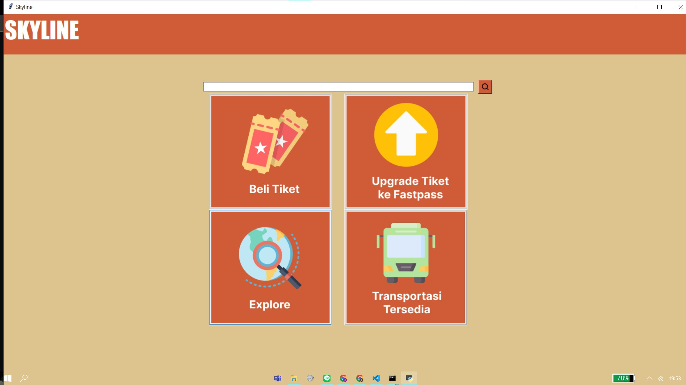
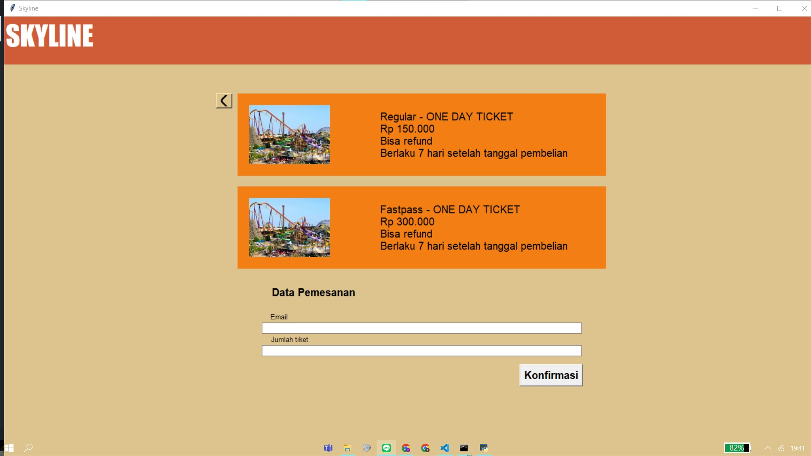
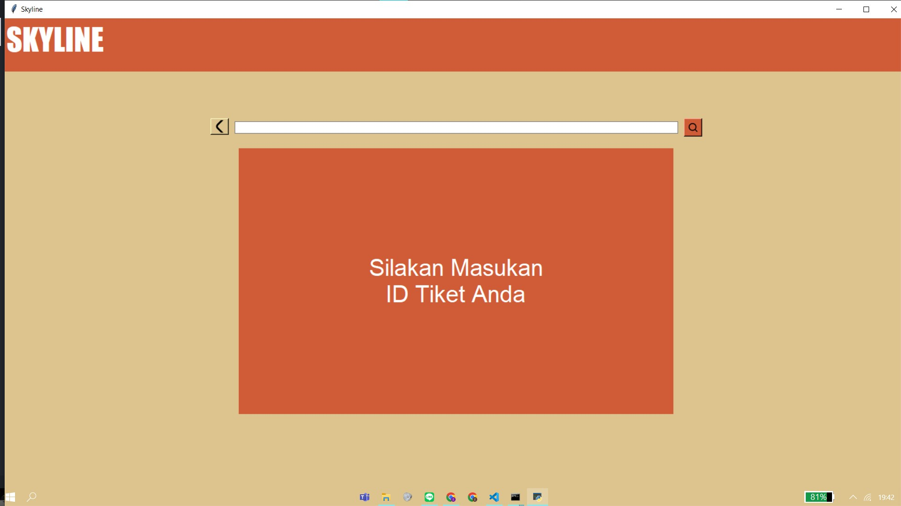
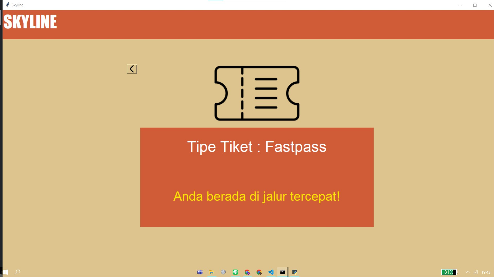
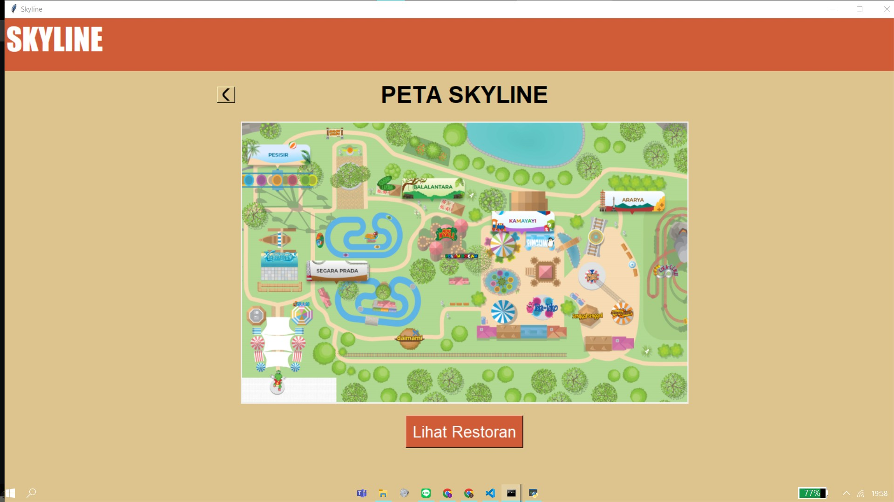
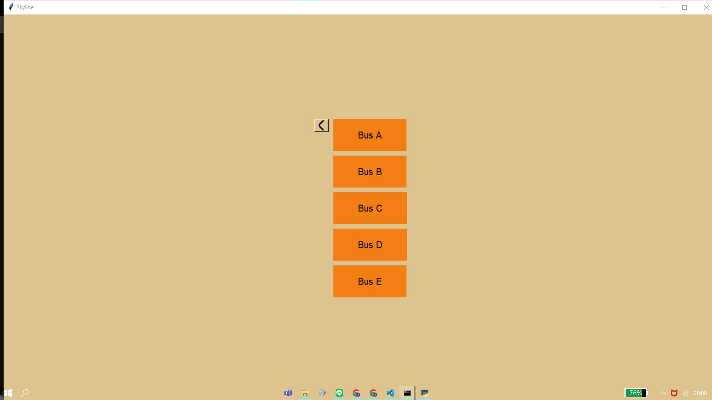
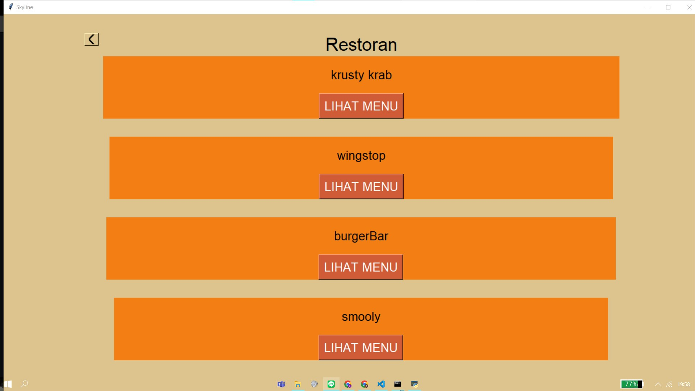
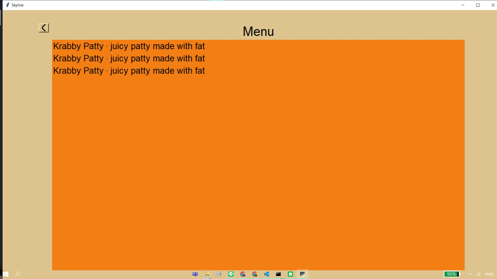

# Skyline
> This repository is made for the final project of II3152 Software Engineering IST.
Skyline is a desktop app developed by Group 01 from II3152 Class 01 to facilitate the overall operational process of a theme park. Some of the functions available in this application, including a feature to buy tickets,
upgrade tickets, provide restaurant information available in theme park, informs the schedule of available public transportation, displays the theme map
park, and displays the details of a ticket.

ID       | Developer Name
---      | ----
18220007 | Joanna Margareth Nauli
18220009 | Fatih Darielma Gaizta
18220039 | Alvito Rizqi Sobri
18220067 | Tania Junardi Chua
18220079 | Zafran Divac Azzahra 
18220077 | William Gunawan


## How To Run
This repository requires you to install all dependencies located in requirements.txt. Build your own virtual environment and type this in your terminal:

```>>> pip install -r requirements.txt```

Then, go to folder ```src``` and type:

```>>> python main.py```

## Modules List

### Main



### Ticket 
#### Buy Ticket



#### Search Ticket


#### Upgrade Ticket



### Map



### Transportation



### Restaurant




## Database List

### Ticket
Attributes      | 
---             | 
id              | 
type            | 
status          |
is_paid         |
email           |
regular_code    |
fastpass_code   |
date_added      |
ticket_id       |

### Transport
Attributes      | 
---             | 
id              | 
name            | 
schedule_star   |
schedule_end    |
origin          |
destination     |

## Restaurant
Attributes      | 
---             | 
id              | 
name            | 
location        |

## Restaurant Menu
Attributes      | 
---             | 
id              |
name            |
price           |
description     |
restaurant_id   |
